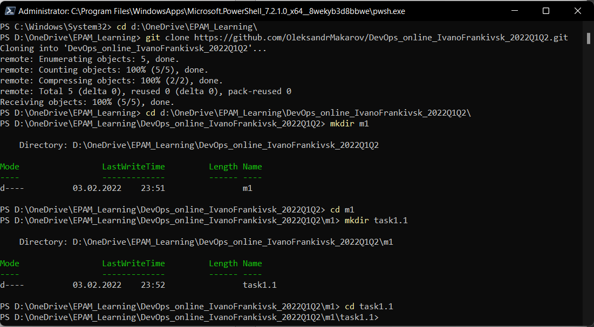

# Module 1
## Task 1.1
#### Configuration
Download and install Git on Windows [Git for Win](https://git-scm.com/download/win)
Configure Git:
```
git config --global user.name "OleksandrMakarov"
git config --global user.email alexander.vmv@gmail.com
```
Register account and create private repo on GitHub using web interface [My repo](https://github.com/OleksandrMakarov/DevOps_online_IvanoFrankivsk_2022Q1Q2)

Clone repo:
```
git clone https://github.com/OleksandrMakarov/DevOps_online_IvanoFrankivsk_2022Q1Q2.git
```
Make repository structure:
```
cd d: \DevOps_online_IvanoFrankivsk_2022Q1Q2\
mkdir m1
cd m1
mkdir task1.1
cd task1.1
```
#### First commit
```
New-Item -Name "readme.txt" -ItemType "file"
git init
git add .
git commit -m "add readme file"
git remote add origin https://github.com/OleksandrMakarov/DevOps_online_IvanoFrankivsk_2022Q1Q2.git
git push -u origin main
```
#### Create branch "develop"

```
git checkout -b develop
New-Item -Name "index.html" -ItemType "file"
git add index.html
git commit -m "add index file"
git push -u origin develop
```
#### Create branch "images"
```
git checkout -b images
mkdir images
cd images
Copy-Item -Path "D:\OneDrive\Pictures\Screenshots\image_1.png" -Destination "D:\DevOps_online_IvanoFrankivsk_2022Q1Q2\m1\task1.1\images"
cd..
git add .
git commit -m "add images folder and file"
git push -u origin images
notepad index.html
    
git add .
git commit -m "change index file"
git push -u origin images
```
#### Create branch "styles"
```
git checkout develop
git branch
git checkout -b styles
mkdir styles
cd styles
New-Item -Name "styles.css" -ItemType "file"
cd..
git add .
git commit -m "added styles file and directory"
git push -u origin styles
```
#### Edit index file in "styles" branch
```
notepad index.html
<!DOCTYPE html>
<html>
<head>
<link rel="stylesheet" href="styles/styles.css">
</head>
<body>

<h1>DevOps</h1>

</body>
</html>
git add .
git commit -m "change index file"
git push -u origin styles
```
#### Merge branches and resolve a conflict
```
git checkout develop
git status
git merge images
git merge styles
git status
cat index.html
notepad index.html
git add index.html
git commit -m "merged and resolved the conflict"
git push -u origin develop
git checkout main
git merge develop
git status
```

#### Check and save logs 
```
git log
git log -p -3
git push origin –all
git reflog
Copy-Item -Path "D:\OneDrive\EPAM_Learning\task1.1_GIT.txt" -Destination "D:\DevOps_online_IvanoFrankivsk_2022Q1Q2\"
git add task1.1_GIT.txt
git commit -m "add task1.1_GIT.txt to repo"
git push -u origin main
```

## DevOps is
