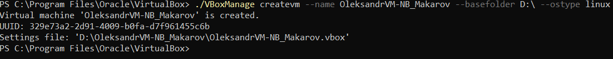
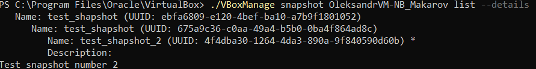
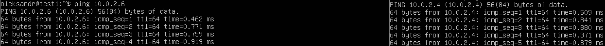

# Module 2
## Task 2.1
## PART 1. HYPERVISORS
 - Hyper-V
 - VMware
 - Oracle VirtualBox
 - Xen
    
    There are two types of hypervisors. The first run on the hardware. The second run in the host OS and virtualized OS works as a guest system.
## PART 2. WORK WITH VIRTUALBOX
## Create and configure virtual machine
```
./VBoxManage createvm --name OleksandrVM-NB_Makarov --basefolder D:\ --ostype Ubuntu_64 --register
```

```
./VBoxManage modifyvm OleksandrVM-NB_Makarov --memory 2048 --vram 16 --ioapic on --graphicscontroller vmsvga
```
#### Create and attach HDD and ISO
 ```
./VBoxManage createhd --filename d:\OleksandrVM-NB_Makarov\disk1 --size 20000 --format vdi
./VBoxManage storagectl OleksandrVM-NB_Makarov --name controller --add sata --portcount 4 --bootable on
./VBoxManage storageattach OleksandrVM-NB_Makarov --storagectl controller --port 1 --device 0 --type hdd --medium D:\OleksandrVM-NB_Makarov\disk1.vdi --nonrotational on
./VBoxManage storageattach OleksandrVM-NB_Makarov --storagectl controller --port 0 --type dvddrive --medium D:\Install_Programs\ubuntu-21.10-live-server-amd64.iso
 ```
#### Control VM
```
./VBoxManage startvm OleksandrVM-NB_Makarov
./VBoxManage controlvm OleksandrVM-NB_Makarov reset
./VBoxManage controlvm OleksandrVM-NB_Makarov savestate
```

#### Clone and group VM
```
./VBoxManage clonevm OleksandrVM-NB_Makarov --name OleksandrVM-NB_Makarov_2 --basefolder d:\ --register
./VBoxManage startvm OleksandrVM-NB_Makarov_2
./VBoxManage controlvm OleksandrVM-NB_Makarov_2 poweroff
./VBoxManage modifyvm "OleksandrVM-NB_Makarov" --groups "/MyGroup"
./VBoxManage modifyvm "OleksandrVM-NB_Makarov_2" --groups "/MyGroup"
```

#### Working with snapshot
```
./VBoxManage controlvm OleksandrVM-NB_Makarov pause
./VBoxManage snapshot OleksandrVM-NB_Makarov take test_shapshot --uniquename Timestamp
./VBoxManage snapshot OleksandrVM-NB_Makarov take test_shapshot_2 --description Test_snapshot_number_2 --uniquename Timestamp
./VBoxManage snapshot OleksandrVM-NB_Makarov list --details
```

```
./VBoxManage controlvm OleksandrVM-NB_Makarov resume
./VBoxManage controlvm OleksandrVM-NB_Makarov poweroff
./VBoxManage snapshot OleksandrVM-NB_Makarov restore 4f4dba30-1264-4da3-890a-9f840590d60b
```

#### OVF export and import
```
./VBoxManage export OleksandrVM-NB_Makarov --output d:\VM1.ova
./VBoxManage import D:\VM1.ova
```
#### Configure VM

```
./VBoxManage modifyvm OleksandrVM-NB_Makarov --usbehci on
./VBoxManage sharedfolder add OleksandrVM-NB_Makarov --name share --hostpath d:\Share\ --automount
./VBoxManage natnetwork add --netname mynatnet --network "192.168.15.0/24" --enable --dhcp on
./VBoxManage modifyvm OleksandrVM-NB_Makarov --nic1 natnetwork --nat-network1 mynatnet
./VBoxManage startvm OleksandrVM-NB_Makarov --type headless
./VBoxManage modifyvm OleksandrVM-NB_Makarov_2 --nic1 natnetwork --nat-network1 mynatnet
./VBoxManage startvm OleksandrVM-NB_Makarov_2
```
I used "nat network" connection and had a conflict because DHCP server assigns the same ip to both VMs.
For solve this problem i should to change linux machine uuid in second VM. I used next command:
```
sudo rm -f /etc/machine-id
sudo dbus-uuidgen --ensure=/etc/machine-id
sudo reboot
```


## PART 3. WORK WITH VAGRANT
