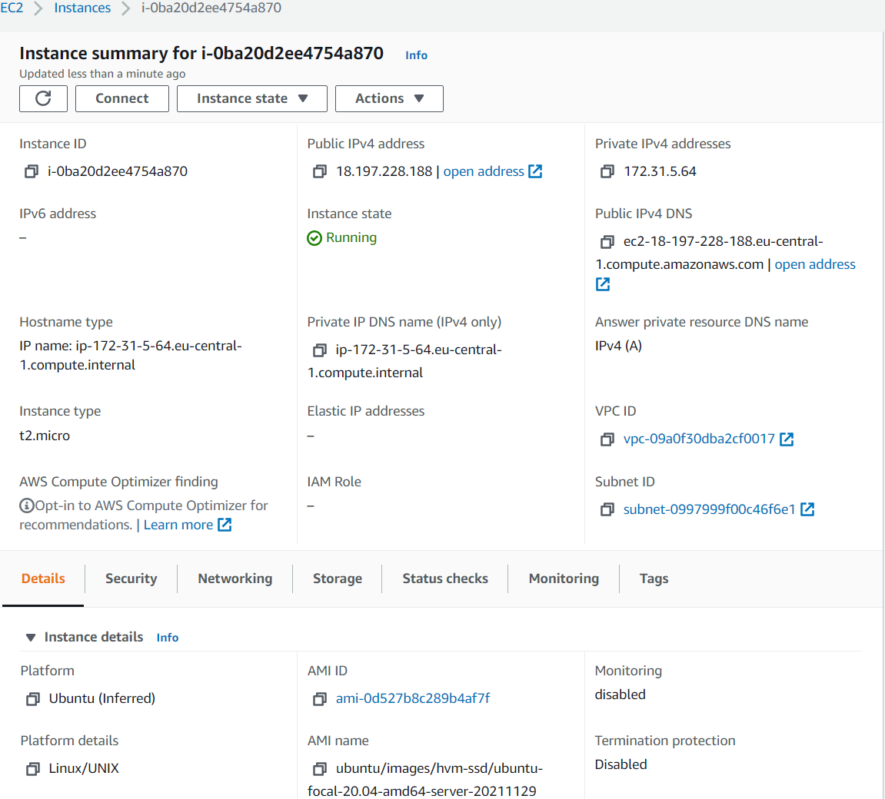
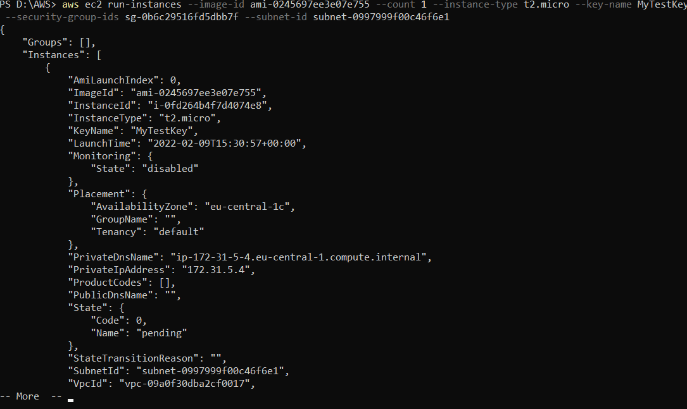
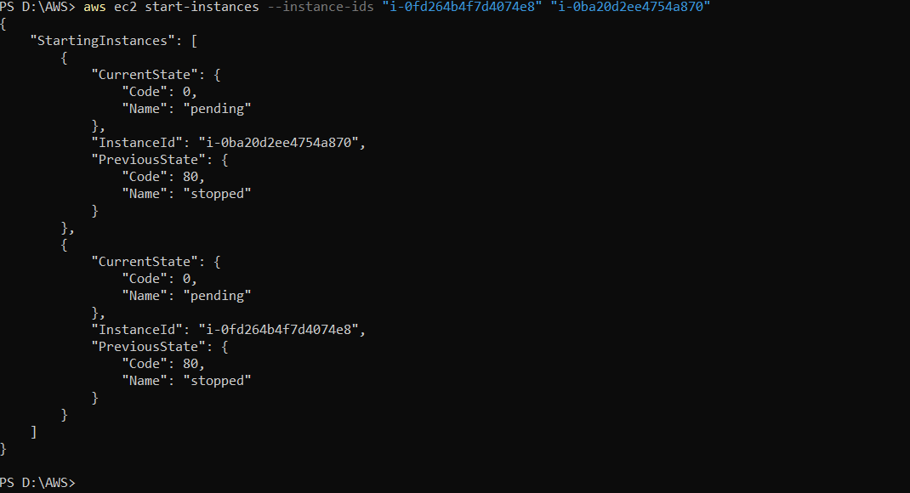
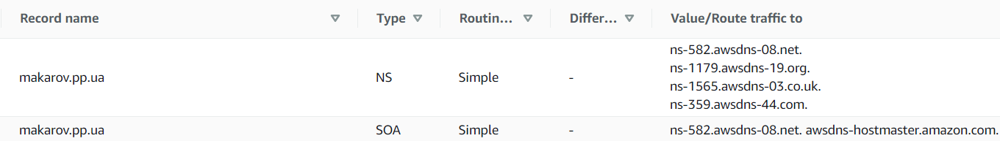
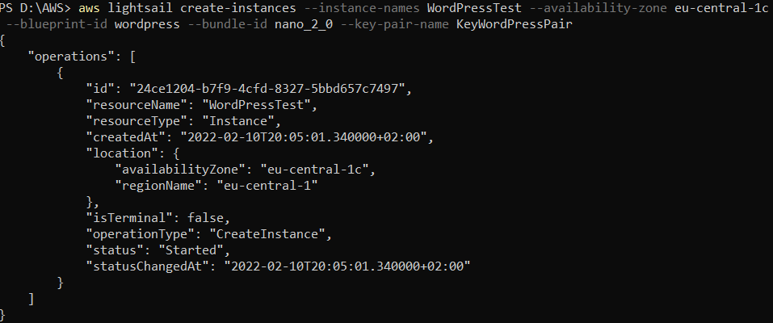
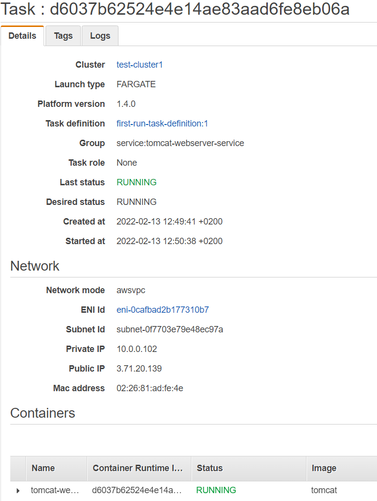
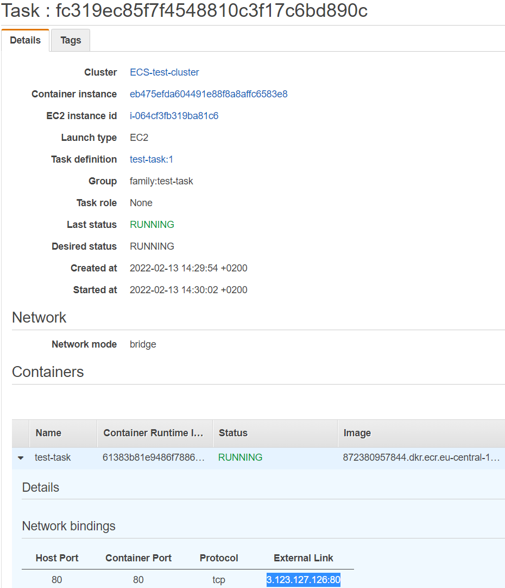
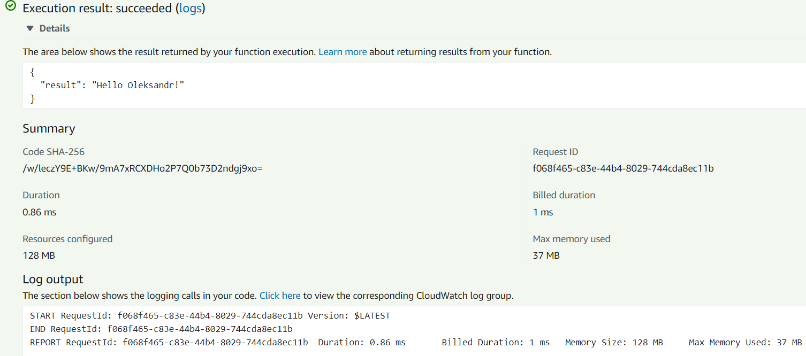

# Module 2
## Task 2.2
#### Install AWS CLI2 and set credentials
WEB: Create default Admin user. Download credentials to *.csv file
```
$ msiexec.exe /i https://awscli.amazonaws.com/AWSCLIV2.msi
$ aws configure import --csv file://D:\new_user_credentials.csv --profile Admin
```
CLI: Make account for test user
```
$ aws iam create-user --user-name MyUser
$ aws iam add-user-to-group --user-name MyUser --group-name mygroup
```
#### Create and configure instances. First from WebUI another one using CLI 

```
$ aws ec2 create-key-pair --key-name MyTestKey --query 'KeyMaterial' --output text > MyTestKey.pem
$ aws ec2 describe-key-pairs --key-name MyTestKey
$ aws ec2 run-instances --image-id ami-0245697ee3e07e755 --count 1 --instance-type t2.micro --key-name MyTestKey --security-group-ids sg-0b6c29516fd5dbb7f --subnet-id subnet-0997999f00c46f6e1
```


```
$ aws ec2 start-instances --instance-ids "i-0fd264b4f7d4074e8" "i-0ba20d2ee4754a870"
$ aws ec2 stop-instances --instance-ids "i-0fd264b4f7d4074e8" "i-0ba20d2ee4754a870"
```


#### Create AMI to keep as a backup
```
$ aws ec2 create-image --instance-id i-0fd264b4f7d4074e8 --name test_2 --description "AMI server 2"
```
#### Create and work with EBS Disk_D
```
$ aws ec2 create-volume --availability-zone eu-central-1c --size 5 --volume-type gp2 --no-encrypted --tag-specifications 'ResourceType=volume,Tags=[{Key=Name,Value=Disk_D},{Key=Disk_D,Value=test_ebs_1}]'
$ aws ec2 attach-volume  --instance-id i-0ba20d2ee4754a870 --volume-id vol-04c5f86625372b982 --device /dev/xvdh
$ aws ec2 start-instances --instance-ids i-0ba20d2ee4754a870
```
For looking for public IP and connecting to machine
```
$ aws ec2 describe-instances --instance-ids i-0ba20d2ee4754a870
```
Before using disk we shood make a file system and mount it
```
$ sudo mkfs.ext4 /dev/xvdh
$ sudo mkdir -p /mnt/disk
$ sudo mount -v /dev/xvdh  /mnt/disk
$ sudo chmod 777 /mnt/disk
```
After mount I create some file 
```
$ echo "some text" > /mnt/disk/textfile.txt
```
#### Launch the second instance from backup and connect Disk_D
```
$ aws ec2 stop-instances --instance-ids i-0ba20d2ee4754a870
$ aws ec2 detach-volume --instance-id i-0ba20d2ee4754a870 --volume-id vol-04c5f86625372b982
$ aws ec2 run-instances --image-id ami-0a3576fd3944decc7 --count 1 --instance-type t2.micro --key-name MyTestKey --security-group-ids sg-0b6c29516fd5dbb7f --subnet-id subnet-0997999f00c46f6e1 --tag-specifications 'ResourceType=instance,Tags=[{Key=Name,Value=Test3}]' --user-data file://d:/script.txt
$ aws ec2 attach-volume  --instance-id i-00c09ec5019f3ef1f --volume-id vol-04c5f86625372b982 --device /dev/xvdh
```
After that mount volume in linux and check our file

#### Register a domain name makarov.pp.ua and link it to Route 53


#### Make a lightsail wordpress server
```
$ aws lightsail get-bundles
$ aws lightsail get-blueprints
$ aws lightsail create-key-pair --key-pair-name KeyWordPressPair --output text > KeyWordPressPair.pem
$ aws lightsail create-instances --instance-names WordPressTest --availability-zone eu-central-1c --blueprint-id wordpress --bundle-id nano_2_0 --key-pair-name KeyWordPressPair
```
[WordPress Makarov][wp_makarov]


#### Create and use S3 bucket
```
$ aws s3 mb s3://s3-makarov --region eu-central-1
$ cd "D:\AWS\s3-makarov"
$ aws s3 sync . s3://s3-makarov --delete
$ aws s3 ls s3://s3-makarov
```
#### Deploy Docker Containers on Amazon Elastic Container Service
For work with docker conteiners I use Docker fo Windows and WSL2 with Ubuntu 20.04
```
$ cd d:\Docker
$ touch Dockerfile
$ start notepad++ Dockerfile
```
Edit dockerfile in order to instruction from AWS. Run apache server with text "Hello World!" 
```
$ docker build -t hello-world .
$ docker scan --accept-license
$ docker scan --json hello-world
$ docker run -t -d -p 80:80 hello-world
$ docker ps
$ docker stop 5cd009f3cf50
```
Create an Amazon ECR repository
```
$ aws ecr create-repository --repository-name test_repo1 --region eu-central-1
$ docker tag hello-world 872380957844.dkr.ecr.eu-central-1.amazonaws.com/test_repo1
$ aws ecr get-login-password | docker login --username AWS --password-stdin 872380957844.dkr.ecr.eu-central-1.amazonaws.com
$ docker push 872380957844.dkr.ecr.eu-central-1.amazonaws.com/test_repo1
# $ aws ecr delete-repository --repository-name test_repo1 --region eu-central-1 --force
```
#### Create a cluster, and run the online demo application.



#### Run a Serverless "Hello, World!" with AWS Lambda.
```
$ aws lambda create-function --function-name my-lambda --runtime python3.9 --zip-file fileb://D:\AWS\my-lambda.zip --handler my-lambda.my_handler --role arn:aws:iam::872380957844:role/service-role/MyHelloWorld-role-kum34ri1
$ aws lambda invoke --cli-binary-format raw-in-base64-out --function-name my-lambda --payload ' { \"name\": \"Oleksandr\" } ' response.json
```


#### Create a static website on Amazon S3, [OleksandrMakarov][makarov]
```
cd "D:\AWS\makarov.pp.ua"
aws s3 mb s3://makarov.pp.ua --region eu-central-1
aws s3 website s3://makarov.pp.ua/ --index-document index.html --error-document error.html
aws s3 sync . s3://makarov.pp.ua --delete --acl public-read
```


[wp_makarov]: <http://wordpress.makarov.pp.ua/>
[makarov]: http://makarov.pp.ua/>]
