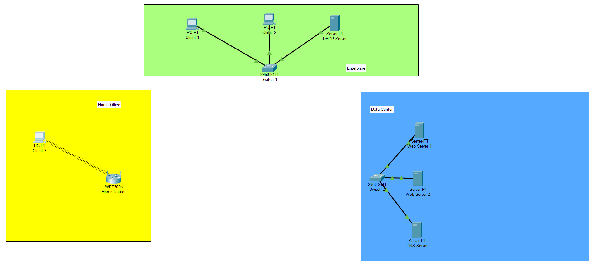
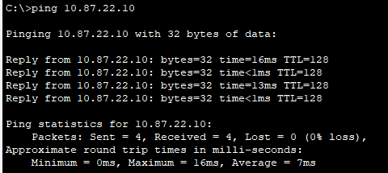
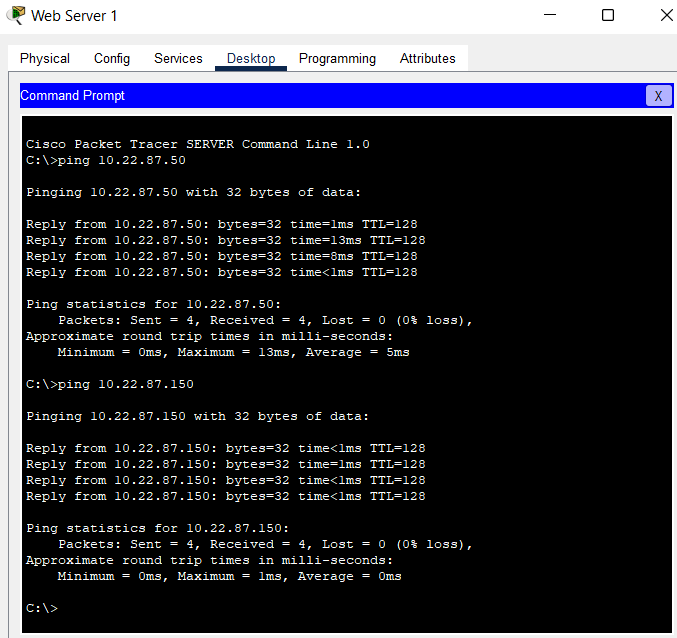
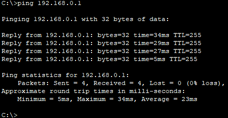
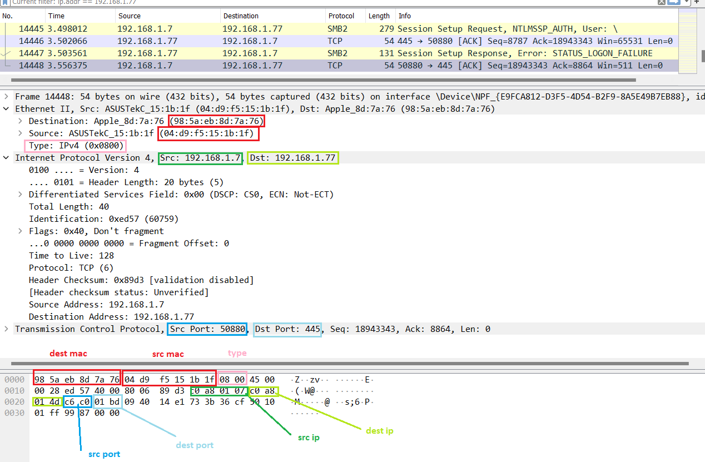

# Module 3
## Task 3.1
## Part 1. Cisco Packet Tracer 
Download *.pkt file <a id="raw-url" href="https://github.com/OleksandrMakarov/DevOps_online_IvanoFrankivsk_2022Q1Q2/raw/main/m3/task3.1/Makarov_Task3.1.pkt">Makarov_Task3.1</a>

#### Create Enterprise network

#### Create Data Center network

#### Create Home Office network

## Part 2. Wireshark

