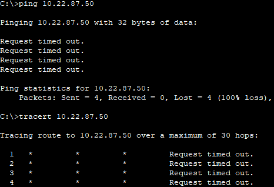
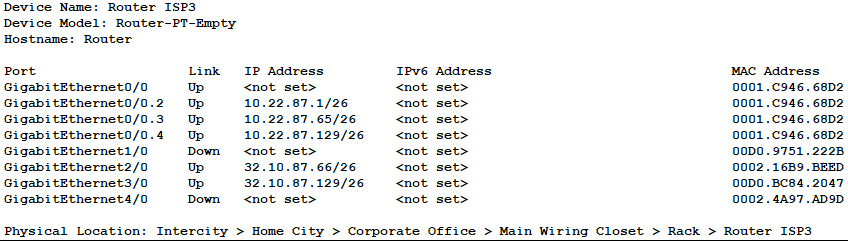
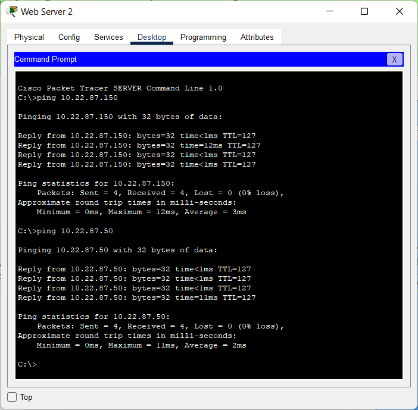

# Module 3
## Task 3.1
Download *.pkt file <a id="raw-url" href="???????????????">Makarov_Task3.2</a>

#### Create network

#### Configure networks and gateways

#### Set up a VLAN in the Data Center 
When subnet mask on machines in Data Center was changed to /26, traffic commence routing through ISP3 router. Because machines in the Data Center were included to subnet where default gateway is ISP3 router.

When VLAN 1,2,3 were made, machines from different VLAN can not ping and tracert each other. Because each VLAN works as a separate (isolated) local network.

#### Set up routing beetween VLAN
Create a subinterfaces

Ping between servers

