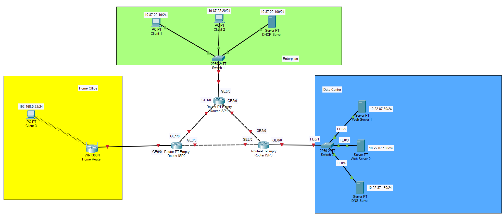
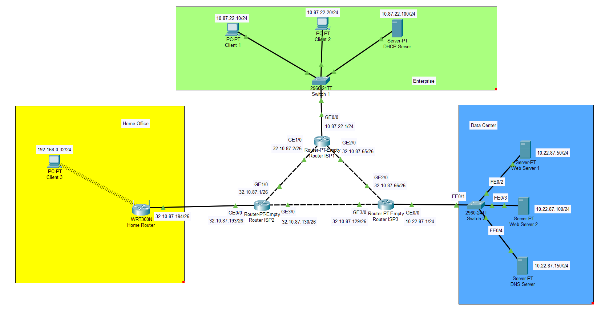
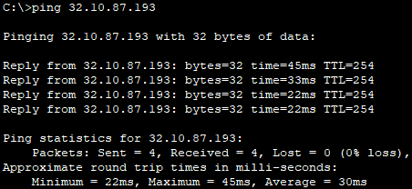
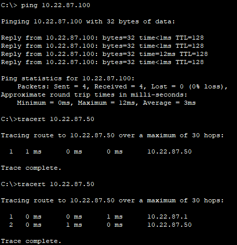

# Module 3
## Task 3.1
Download *.pkt file [Task3.1][task3.1]

#### Create network

#### Maintaine networks and gateways

#### Setting up a VLAN in the Data Center 
When subnet mask on machines in Data Center was changed to /26, traffic commence routing through ISP3 router. Because machines in the Data Center were included to subnet where default gateway is ISP3 router.

