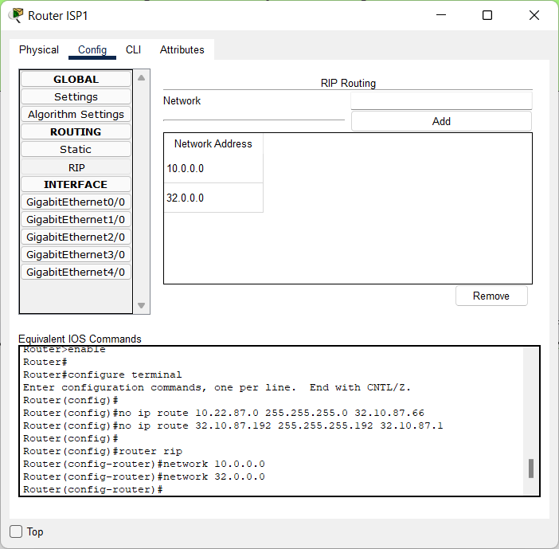

# Module 3
## Task 3.3
Download *.pkt file <a id="raw-url" href="????????????">Makarov_Task3.2</a>

## Set up routing
#### Routing Table filled in according to my d.m.y data

#### Set up routing on ISP 1, 2, 3

Check ping and trace

#### Set up dynamic routing RIP (Routing information protocol)

#### For avoiding a conflict of dynamic routing I should change IP adresses in Data Center network to 11.D.Y.0 and subinterfaces into ISP3

Check ping and route trace

