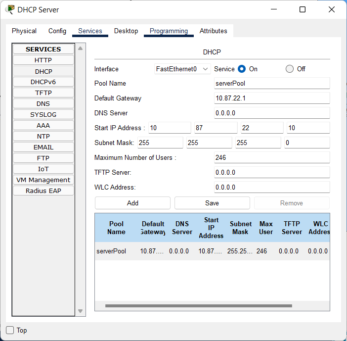
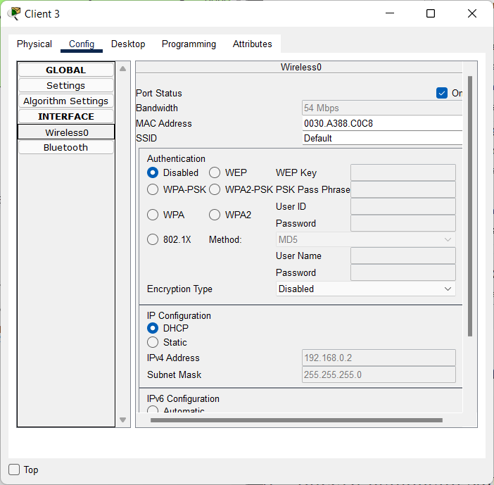
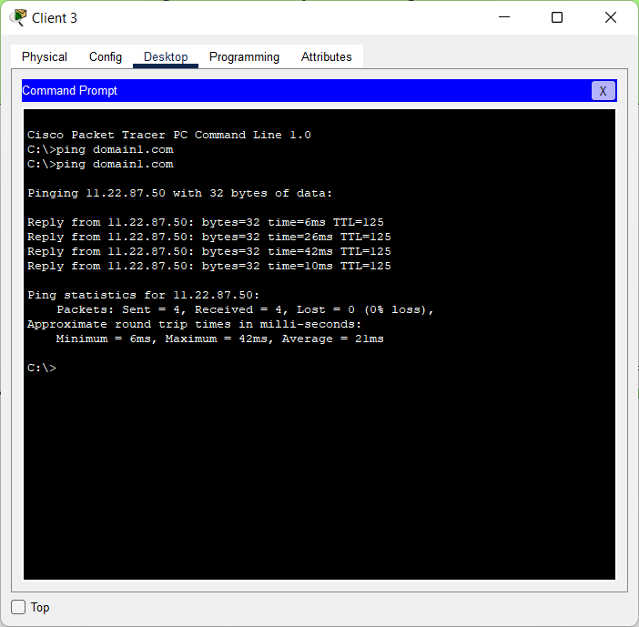
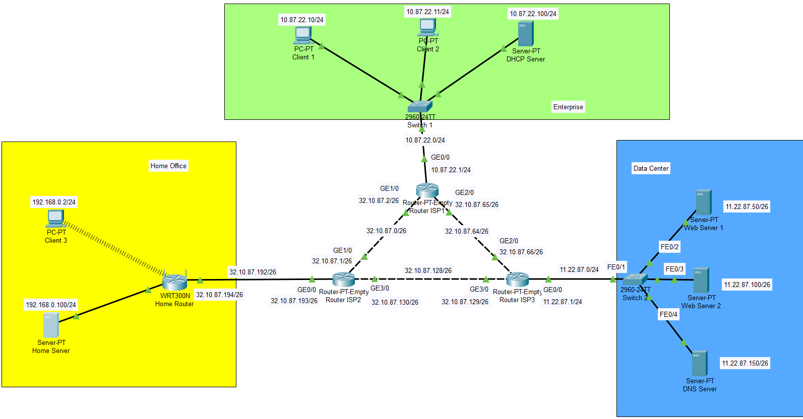
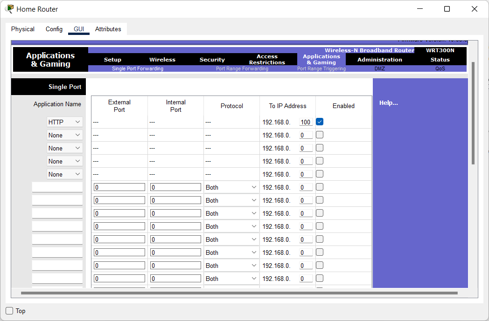
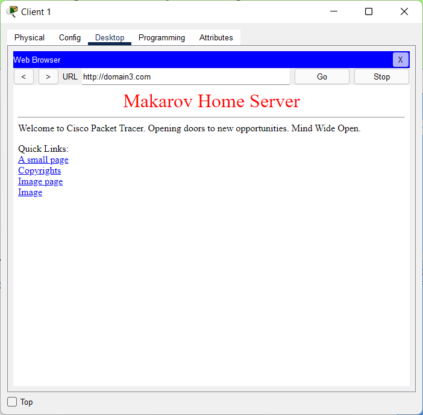

# Module 3
## Task 3.4
Download *.pkt file <a id="raw-url" href="https://github.com/OleksandrMakarov/DevOps_online_IvanoFrankivsk_2022Q1Q2/raw/main/m3/task3.4/Makarov_Task3.4.pkt">Makarov_Task3.4</a>

## Set up DHCP
On DHCP server

Setting up DHCP on Home Router and check on Client 3

## Set up DNS services
Ping domain1

## Set up Port Forwarding and DNS
Add and set up a Home Server

Set up Port Forwarding

Check Home Server site

