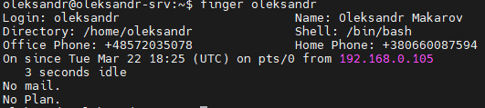

# Module 4
## Task 4.1. 
### Part 1

#### Change the password for user
This command changes next system files:
/etc/passwd
/etc/shadow

#### Determine the users registered in the system and explore command $finger

#### Change personal information
```
$ sudo chfn --full-name "Oleksandr Makarov" --home-phone +380660087594 --work-phone +48572035078 oleksandr
```

#### Become familiar with the Linux help system
```
$ info finger
$ chfn --help
$ man chfn
```
chfn [-f, --full-name FULL_NAME][user] --- change user's full name
finger [-s] [user] --- Finger displays the user's login name, real name, terminal    name and write status (as a ``*'' after the terminal name if write permission is     denied), idle time, login time, office location and office phone number.

#### Explore the more and less commands using the help system
```
$ ls --help
$ ls -a
$ man cat
$ cat -E .bash_history
```


### Part 2
#### Examine the $tree command


#### Command $file can be used to determine the type of file

#### Relative and absolute paths
An **absolute path** is defined as specifying the location of a file or directory from the root directory(/). In other words,we can say that an absolute path is a complete path from start of actual file system from / directory.
**Relative path** is defined as the path related to the present working directly(pwd). It starts at your current directory and never starts with a / .
We can back to our home directory from whenever use command 
```
$cd
```
#### Command $ls
The **ls** command is used to list files or directories in Linux and other Unix-based operating systems.

**$ls -l** command to list the contents of the directory in a table format with columns
**$ls -a** command to list files or directories including hidden files or directories.

#### 5) Perform the following sequence of operations:
- create a subdirectory in the home directory;
- in this subdirectory create a file containing information about directories located in the root directory (using I/O redirection operations);
- view the created file;
- copy the created file to your home directory using relative and absolute addressing.
- delete the previously created subdirectory with the file requesting removal;
- delete the file copied to the home directory.


#### 6) Perform the following sequence of operations:
- create a subdirectory test in the home directory;
- copy the .bash_history file to this directory while changing its name to labwork2;
- create a hard and soft link to the labwork2 file in the test subdirectory;
```
$mkdir test
$sudo cp .bash_history \test/labwork2
$cd \test
$sudo ln labwork2 labwork2_hard
$sudo ln -s labwork2 labwork2_sym
```
- how to define soft and hard link, what do these concepts;

A **hard link** is a separate file, and this file references or points to the exact spot on a hard drive where the Inode stores the data.
A **soft link** isn't a separate file, it points to the name of the original file, rather than to a spot on the hard drive

To define soft and hard link use command $ls -lia.
Hardlink has the same inods. In the symlink we can see a link to the original file. Also symlink marks **l** symbol in the beginning of permissions column.

- change the data by opening a symbolic link. What changes will happen and why 

After editing of symlink file, original file and hard link file change too. It happens because opening a symlink means opening an original file. Hardlink file was changed too because it links with original file as a copy.
- rename the hard link file to hard_lnk_labwork2;
- rename the soft link file to symb_lnk_labwork2 file;
- then delete the labwork2. What changes have occurred and why?

```
$mv labwork2_hard hard_lnk_labwork2
$mv labwork2_sym "symb_lnk_labwork2 file"
$rm labwork2
```
When try to open "symb_lnk_labwork2 file" we receive an error becouse it links to non existence file. File "hard_lnk_labwork2" opens OK.

#### Command $locate
```
$sudo updatedb
$locate squid
$locate traceroute
```


#### Determine which partitions are mounted in the system, as well as the types of these partitions
```
$df -T -h
or
$df -a -T -h
or
$lsblk
```

#### Count the number of lines containing a given sequence of characters in a given file.
```
$grep -c sudo .bash_history
```

#### Using the find command, find all files in the /etc directory containing the host character sequence.
```
$sudo find . -name 'host*'
```

#### List all objects in /etc that contain the ss character sequence. How can I duplicate a similar command using a bunch of grep?
```
$sudo find /etc -iname 'ss*'
$ls | grep 'ss'
```

#### Organize a screen-by-screen print of the contents of the /etc directory. Hint: You must use stream redirection operations.
```
$ls -a -1 /etc >> print.txt
```
#### What are the types of devices and how to determine the type of device? Give examples.
Linux supports three types of hardware device: character, block and network. **Character devices** are read and written directly without buffering, for example the system's serial ports /dev/cua0 and /dev/cua1. 
**Block devices** can only be written to and read from in multiples of the block size, typically 512 or 1024 bytes. Block devices are accessed via the buffer cache and may be randomly accessed, that is to say, any block can be read or written no matter where it is on the device. Block devices can be accessed via their device special file but more commonly they are accessed via the file system. Only a block device can support a mounted file system. 
**Network devices** are accessed via the BSD socket interface and the networking subsytems
```
$ls -l -1 /dev/
```

First character on each line specifies the device type. The symbol "b" denotes linux block devices (block), and the symbol "c" denotes character devices (character).
#### How to determine the type of file in the system, what types of files are there?
Command $file can be used to determine the type of file
#### List the first 5 directory files that were recently accessed in the /etc directory.
```
ls -l -h -t | head -5
```
-l outputs in a list format
-h makes output human readable (i.e. file sizes appear in kb, mb, etc.)
-t sorts output by placing most recently modified file first
