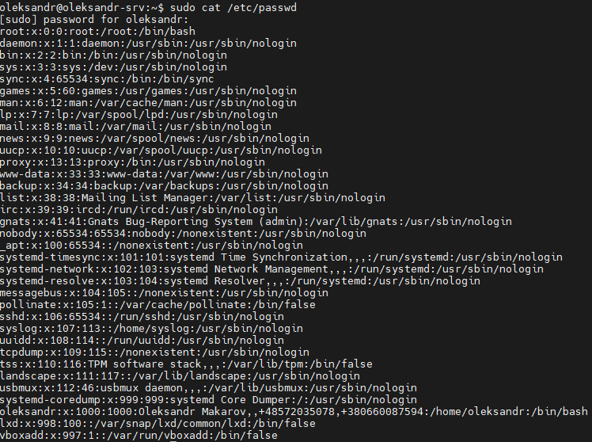
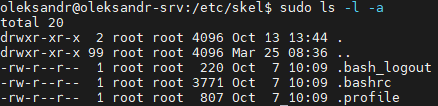
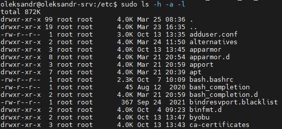
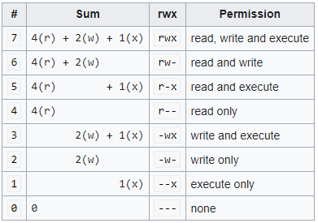
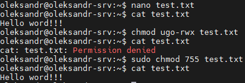
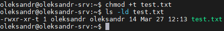

# Module 4
## Task 4.2.
#### 1) Analyze the structure of the /etc/passwd and /etc/group file, what fields are present in it, what users exist on the system? Specify several pseudo-users, how to define them?



**Record's structure /etc/passwd**
login:password:UID:GID:GECOS:home:shell
**Record's structure /etc/group**
group_name:password:group ID (GID):group List
For determine active users we can use commands $w or $who

#### 2) What are the uid ranges? What is UID? How to define it?
UID 0 (zero) is reserved for the root.
UIDs 1–99 are reserved for other predefined accounts.
UID 100–999 are reserved by system for administrative and system accounts/groups.
UID 1000–10000 are occupied by applications account.
UID 10000+ are used for user accounts.

UID (user identifier) is a number assigned by Linux to each user on the system. This number is used to identify the user to the system and to determine which system resources the user can access.

To define users UID use command $id or read file /etc/passwd
#### 3) What is GID? How to define it?
Groups in Linux are defined by GIDs (group IDs)
GID 0 (zero) is reserved for the root group.
GID 1–99 are reserved for the system and application use.
GID 100+ allocated for the user’s group.
To define users GID use command $id -g or read file /etc/group
#### 4) How to determine belonging of user to the specific group?
```
$id -g user_name
```
#### 5) What are the commands for adding a user to the system? What are the basic parameters required to create a user?
```
$adduser [option] [user_name]
```
Basic parameters for new user listed below:
Username: User login name used to login into the system. It should be between 1 to 32 characters long.
Password: User password (or x character) stored in /etc/shadow file in encrypted format.
User ID (UID): Every user must have a User ID (UID) User Identification Number. By default, UID 0 is reserved for the root user and UID’s ranging from 1-99 are reserved for other predefined accounts. Further UID’s ranging from 100-999 are reserved for system accounts and groups.
Group ID (GID): The primary Group ID (GID) Group Identification Number stored in the /etc/group file.
User Info: This field is optional and allows you to define extra information about the user. For example, user full name. This field is filled by the ‘finger’ command.
Home Directory: The absolute location of the user’s home directory.
Shell: The absolute location of a user’s shell i.e. /bin/bash.
#### How do I change the name (account name) of an existing user?
```
$ usermod -l new_username old_username
```
#### 7) What is skell_dir? What is its structure?
The /etc/skel directory contains files and directories that are automatically copied over to a new user’s when it is created from $useradd command. This will ensure that all the users get same intial settings and environment.



#### 8) How to remove a user from the system (including his mailbox)?
```
$userdel [OPTIONS] USERNAME
```
Use the **-r (--remove)** option to force $userdel to remove the user’s home directory and mail spool
#### 9) What commands and keys should be used to lock and unlock a user account?
For lock:
Option 1: Use the command “passwd -l username”
Option 2: Use the command “usermod -l username”
For unlock:
Option 1: Use the command “passwd -u username”
Option 2: Use the command “usermod -U username”
For check status of user read file /etc/shadow. Sign (!) marks locked user
#### 10) How to remove a user's password and provide him with a password-free login for subsequent password change?
To force a user to change his password, first of all the password must have expired and to cause a user’s password to expire, you can use the $passwd command with key **-e** or **--expire**
```
$ passwd -e user_name
```
#### 11) Display the extended format of information about the directory, tell about the information columns displayed on the terminal.
```
sudo ls -h -a -l
```

Columns explanation:
**The first column** gives the type of the file (e.g. directory or ordinary file) and the file permissions.
**The second column** is the number of links to the file.
**The third column** shows the owner of the file.
**The fourth column** shows the group of users to which the file belongs.
**The fifth column** is the size of the file 
**The next three columns** show the time when the file was last changed (for a directory, this is the time when a file in that directory was last created or deleted).
**The final column** is the name of the file.
#### 12) What access rights exist and for whom (i. e., describe the main roles)? Briefly describe the acronym for access rights.
Permission Types:
Three permission types exist in the Linux system.
Read:
This permission is used to read any file or folder only. It is denoted by **‘r’** when it is defined by character, and it is denoted by **4** when it is defined by a number.
Write:
This permission is used to write, append, or override any file or folder. It is denoted by **‘w’** when it is defined by the character, and it is denoted by **2** when it is defined by the number. If the user has to write permission to a file, but he/she has not to write permission on the folder where the file is located, then the user can modify the content of the file only, but he/she will not able to rename, move or delete the file.
Execute:
This permission is used to execute any file only. It is denoted by **‘x’** when it is defined by the character, and it is denoted by **1** when it is defined by the number.
Acronim **UGO**: User, group, others
Numerical permissions:



#### 13) What is the sequence of defining the relationship between the file and the user?
By default, the owner of a file is the user who created it and the group assigned to a file is the primary group of the user. However, you can change the group of a file using $chgrp.
#### 14) What commands are used to change the owner of a file (directory), as well as the mode of access to the file? Give examples, demonstrate on the terminal.
Use comand $chmod [options][destination]



#### 15) What is an example of octal representation of access rights? Describe the umask command.


On Linux and Unix operating systems, all new files are created with a default set of permissions. The umask utility allows you to view or to set the file mode creation mask, which determines the permissions bits for newly created files or directories.
#### 16) Give definitions of sticky bits and mechanism of identifier substitution. Give an example of files and directories with these attributes.
A Sticky bit is a permission bit that is set on a file or a directory that lets only the owner of the file/directory or the root user to delete or rename the file. No other user is given privileges to delete the file created by some other user.
```
chmod -t test.txt
```


#### 17) What file attributes should be present in the command script?
**Script command** in Linux is used to make typescript or record all the terminal activities. After executing the script command it starts recording everything printed on the screen including the inputs and outputs until exit.
**-rw-rw-r--** should be present in the command script. 