# Module 4
## Task 4.3.
## Part 1
#### 1. How many states could has a process in Linux?
In Linux, a process is an instance of executing a program or command. While these processes exist, they’ll be in one of the five possible states:
Running or Runnable (R)
Uninterruptible Sleep (D)
Interruptable Sleep (S)
Stopped (T)
Zombie (Z)
#### 2) Examine the pstree command. Make output (highlight) the chain (ancestors) of the current process.
Comman $pstree lists the running processes, shows them in a tree
```
$pstree oleksandr -p
```
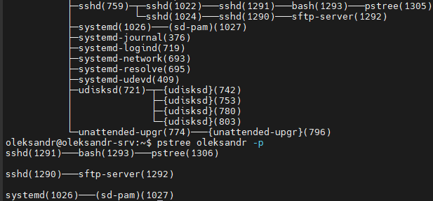

#### 3. What is a proc file system?
The proc filesystem (procfs) is a special filesystem in Unix-like operating systems that presents information about processes and other system information in a hierarchical file-like structure, providing a more convenient and standardized method for dynamically accessing process data held in the kernel than traditional tracing methods or direct access to kernel memory. Typically, it is mapped to a mount point named /proc at boot time. The proc file system acts as an interface to internal data structures about running processes in the kernel. In Linux, it can also be used to obtain information about the kernel and to change certain kernel parameters at runtime (sysctl).

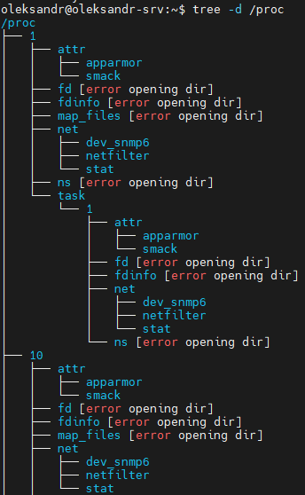

#### 4. Print information about the processor (its type, supported technologies, etc.).
```
$lscpu
```
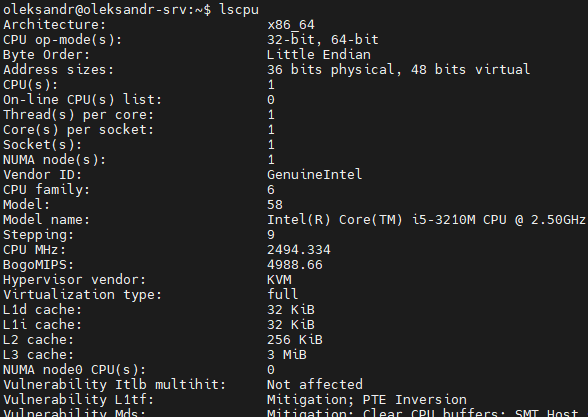

#### 5. Use the ps command to get information about the process. The information should be as follows: the owner of the process, the arguments with which the process was launched for execution, the group owner of this process, etc.
```
ps -fL
```
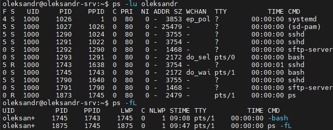

#### 6. How to define kernel processes and user processes?
Kernel processes have PID == 2 and PPID == 2
```
sudo ps -l --ppid=2 --pid=2
```
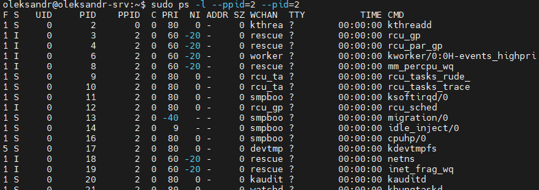

#### 7. Print the list of processes to the terminal. Briefly describe the statuses of the processes. What condition are they in, or can they be arriving in?
```
$ps aux | head
```
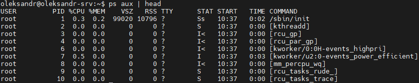

a = show processes for all users
u = display the process's user/owner
x = also show processes not attached to a terminal
**STATUS:**
D - uninterruptible sleep (usually IO)
R -	running or runnable (on run queue)
S -	interruptible sleep (waiting for an event to complete)
T -	stopped by job control signal
t -	stopped by debugger during the tracing
w -	paging (not valid since the 2.6.xx kernel)
x -	dead (should never be seen)
Z -	defunct ("zombie") process, terminated but not reaped by its parent
< -	high-priority (not nice to other users)
N -	low-priority (nice to other users)
L -	has pages locked into memory (for real-time and custom IO)
s -	is a session leader
l - is multi-threaded (using CLONE_THREAD, like NPTL pthreads do)
"+" -	is in the foreground process group
#### 8. Display only the processes of a specific user.
```
$ps aux | grep oleksa
```
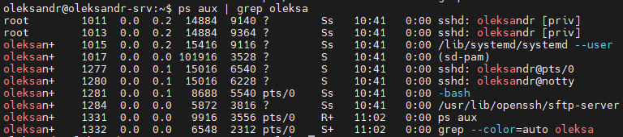

#### 9. What utilities can be used to analyze existing running tasks (by analyzing the help for the ps command)?
 - To list all processes that are currently running on the system including processes owned by other users use ```$ps ax```
 - To display the owner alongside each process use ```$ps aux```
 - You can also use the ps command in a combination with grep to see if a particular process is running ```$ps aux | grep oleksa```

Also we can use next command ```$top``` and ```$htop```
#### 10. What information does top command display?
The top command (table of processes) displays the processor activity of your Linux box and also displays tasks managed by the kernel in real-time. It also shows information about CPU and memory utilization of a list of running processes.
#### 11. Display the processes of the specific user using the top command.
```
$top -u oleksandr
```
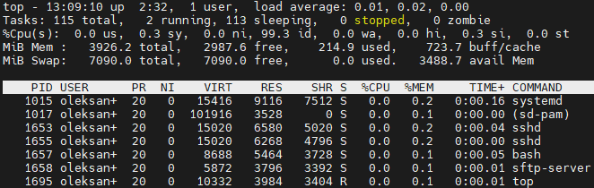

#### 12. What interactive commands can be used to control the top command? Give a couple of examples.
**? or h** to get Help
**d or s** to change delay time interval
**k** kill-a-task 
**r** Renice-a-Task. You are prompted for a PID and then the value to nice. Entering a positive value causes a process to lose priority. Conversely, a negative value cause sa process to be viewed more favorably by the kernel.
**w** write the configuration file. This key saves all your options and toggles, plus the current display mode and delay time. By issuing this command before quitting top, you can restart later in exactly that same state.
**q** Quit
#### 13. Sort the contents of the processes window using various parameters (for example, the amount of processor time taken up, etc.)
Use next interactive commands to sort in command $top
**u** Sorts the list by user
**M** Sorts the list by memory usage
**P** Sorts the list by CPU usage.

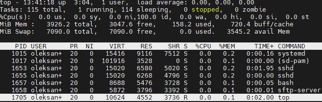

#### 14. Concept of priority, what commands are used to set priority?
In reality, each process is assigned a process scheduling policy. Within this policy, there is a 40 point scale used to measure the nice levels of a process. The nice level is a unit of measure that describes the relative priority of the process. When discussing niceness levels, note that the scale is -20 (highest priority) to 19 (lowest priority), and that a process inherits its nice level from the parent (most often 0).
Now, if a process has a lower niceness level (sub-zero), then it will be less likely to give up its CPU usage. On the flip side, a process with a high niceness value (exceeding zero) will be more likely to give up CPU usage.
An easy way to remember this is if someone (or a process) is really nice, they are more inclined to share with others. If they are not very nice, they tend to be more protective over what belongs to them (CPU resources, in this case).
Also, if there is no shortage of resources, even processes with high niceness levels will use all available CPU time. The only time a process will yield its resources is when there is a bandwidth shortage.

With command ```$nice``` we start new process with definite priority
With command ```$renice``` we change a priority of existing process
```
$nice -n 15 apt update
$renice -n 15 -p 5645
```
#### 15. Can I change the priority of a process using the top command? If so, how?
For change the process priority in top command use interactive command **R** and enter a PID of process
#### 16. Examine the kill command. How to send with the kill command process control signal? Give an example of commonly used signals.
```$kill``` is a command used to send a signal to a process. By default, the message sent is the termination signal, which requests that the process exit. But kill is something of a misnomer; the signal sent may have nothing to do with process killing.
Options:
      -s sig    SIG is a signal name
      -n sig    SIG is a signal number
      -l        list the signal names; if arguments follow `-l' they are
                assumed to be signal numbers for which names should be listed
      -L        synonym for -l
```$kill -s SIGSTOP 1371``` - suspend process
```$kill -s SIGCONT 1371``` - resume process
#### 17. Commands jobs, fg, bg, nohup. What are they for? Use the sleep, yes command to demonstrate the process control mechanism with fg, bg.
```$jobs``` display a list of the jobs with their status
```$fg``` move a background job into the foreground
```$bg``` resume suspended jobs by running them as background jobs
```$nohup``` is a POSIX command which means "no hang up". Its purpose is to execute a command such that it ignores the HUP (hangup) signal and therefore does not stop when the user logs out

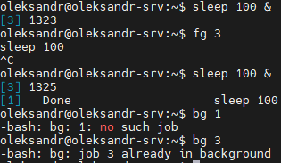

## Part 2
#### 1. Check the implementability of the most frequently used OPENSSH commands in the MS Windows operating system. (Description of the expected result of the commands +screenshots: command – result should be presented)
The OpenSSH suite consists of the following tools:
Remote operations are done using ssh, scp, and sftp.
Key management with ssh-add, ssh-keysign, ssh-keyscan, and ssh-keygen.
The service side consists of sshd, sftp-server, and ssh-agent.

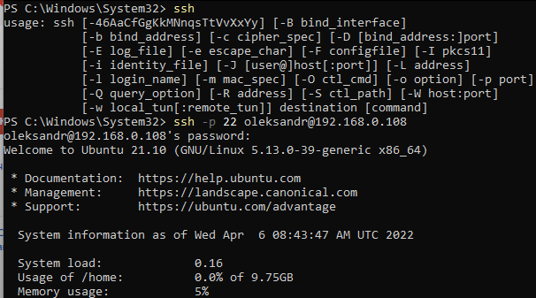

#### 2. Implement basic SSH settings to increase the security of the client-server connection (at least)
Changing SSH port is one of basic settings to increase security.
Edit file /etc/ssh/sshd_config

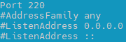

#### 3. List the options for choosing keys for encryption in SSH. Implement 3 of them.

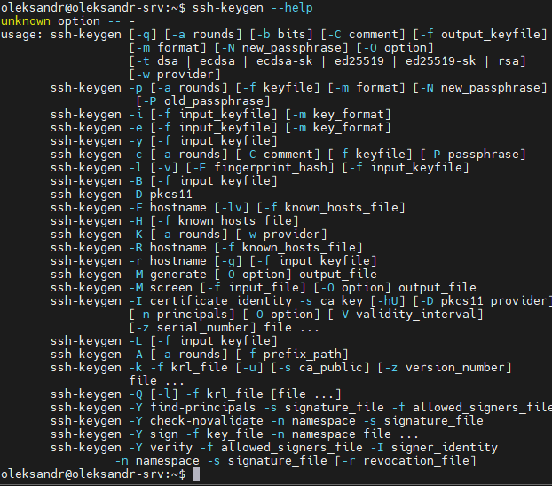

```
$ssh-keygen -t rsa -b 2046 -f /home/oleksandr/rsa_ubuntu_m4
```

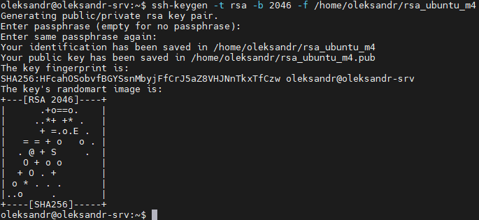

#### 4. Implement port forwarding for the SSH client from the host machine to the guest Linux virtual machine behind NAT.

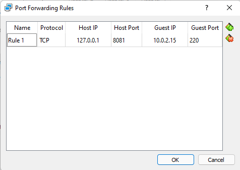

#### 5*. Intercept (capture) traffic (tcpdump, wireshark) while authorizing the remote client on the server using ssh, telnet, rlogin. Analyze the result.

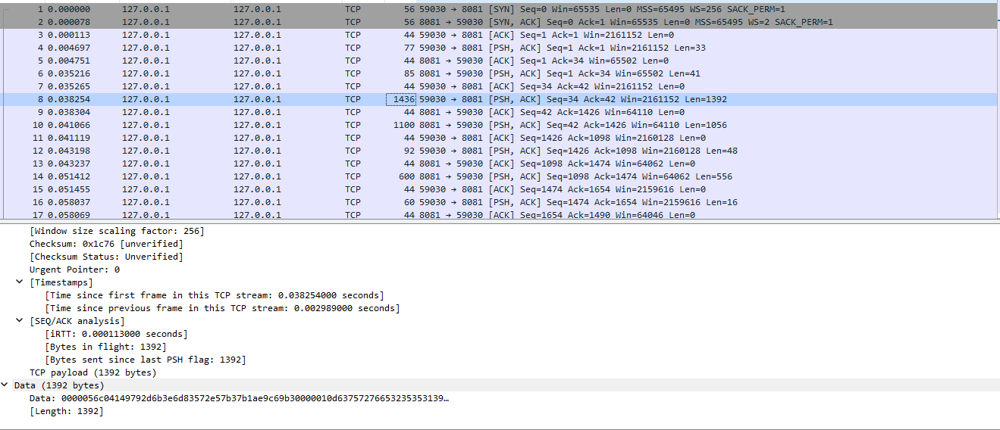
