# Module 5
## Task 5
#### 1. Configure static addresses on all interfaces Server_1
```
$sudo nano /etc/netplan/00-installer-config.yaml
```
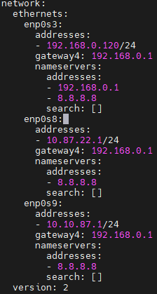

#### 2. Install and configure DHCP server on Server_1
```
$sudo apt install isc-dhcp-server
$sudo nano /etc/dhcp/dhcpd.conf
```
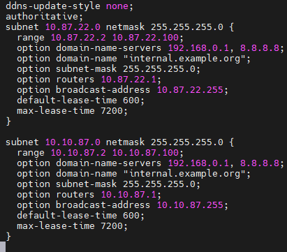

```
$sudo nano /etc/default/isc-dhcp-server
```

```
$sudo systemctl restart isc-dhcp-server.service
$dhcp-lease-list
```
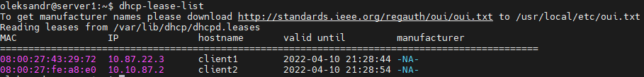

#### 3. Commands ```$ping``` and ```$traceroute``` between clients
There is no connection between client becouse each of them belongs to different networks.
#### 4. Configure routing
Client_1
```
$sudo ip addr add 172.17.32.1/24 dev lo
$sudo ip addr add 172.17.42.1/24 dev lo
```
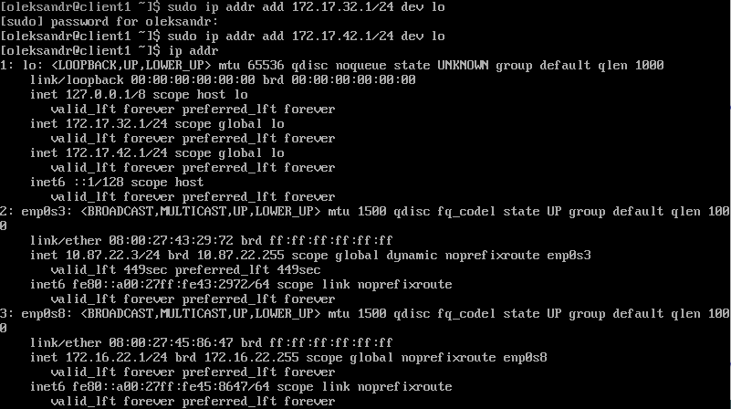

Client_2
```
$sudo ip route add 10.87.22.0/4 via 10.10.87.1
$sudo ip route add 172.17.32.0/24 via 10.10.87.1
```
Server_1
```
$sudo ip route add 172.17.32.0/24 via 10.87.22.3
```
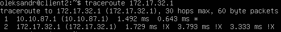
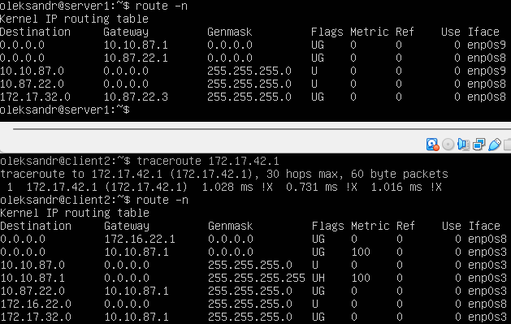

#### 5. Summarizing
A static summary route is used to minimize the number of static routes in the routing table and lessen the administrative overhead that may impact the memory usage of the routers.

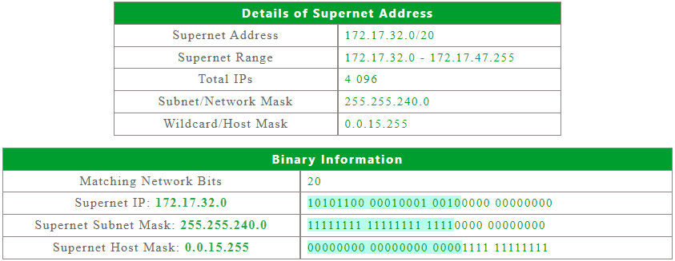

Server_1
```
$sudo ip route add 172.17.32.0/20 via 10.87.22.3
```
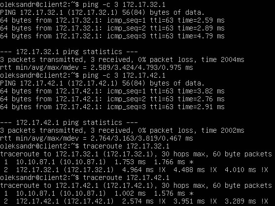

#### 6. SSH configure

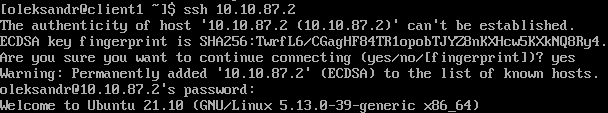

#### 7. Firewall configure
```
$sudo iptables -A INPUT -p tcp -s 10.87.22.3/24 --dport 22 -j ACCEPT
$sudo iptables -A INPUT -p tcp -s 10.10.87.2/24 --dport 22 -j DROP
$sudo iptables -A FORWARD -p icmp -s 10.10.87.2/24 -d 172.17.32.1/24 -j ACCEPT
$sudo iptables -A FORWARD -p icmp -s 10.10.87.2/24 -d 172.17.42.1/24 -j DROP
```
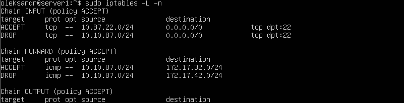

#### 8. NATconfigure
```
$sudo iptables -t nat -A POSTROUTING -j MASQUERADE
or
$sudo iptables -t nat -A POSTROUTING -s 10.0.0.0/9 -j SNAT --to-source 192.168.1.120
```
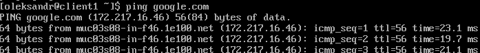