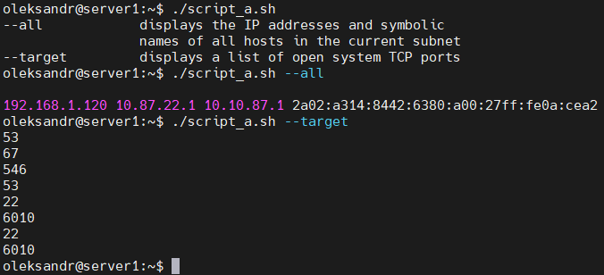

# Module 6
## Task 6
#### A. Create a script that uses the following keys:
1. When starting without parameters, it will display a list of possible keys and their description.
2. The --all key displays the IP addresses and symbolic names of all hosts in the current subnet
3. The --target key displays a list of open system TCP ports.
The code that performs the functionality of each of the subtasks must be placed in a separate function

<details> 
  <summary>script_a1.sh </summary>

```
 #!/bin/bash
 function show_all {
    hostname -a && hostname -I && hostname -d
}
function show_target {
    ss -tulpn | tr -s ' ' | cut -d ' ' -f5 | rev | cut -d: -f 1 | rev | tail -n +2
}
function show_help {
    echo $'--all \t\t displays the IP addresses and symbolic \n\t\t names of all hosts in the current subnet'
    echo $'--target \t displays a list of open system TCP ports'
}
if [ -z "$1" ]
    then
        show_help
        exit 0
fi

while [ -n "$1" ]
do
    case "$1" in
        --all) show_all;;
        --target) show_target;;
    esac
shift;
done
```
</details>


