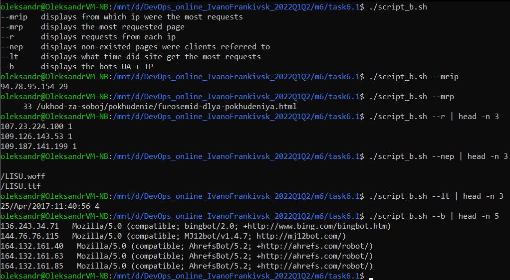

# Module 6
## Task 6
#### A. Create a script that uses the following keys:
1. When starting without parameters, it will display a list of possible keys and their description.
2. The --all key displays the IP addresses and symbolic names of all hosts in the current subnet
3. The --target key displays a list of open system TCP ports.
The code that performs the functionality of each of the subtasks must be placed in a separate function

<details> 
  <summary>script_a.sh </summary>

```
 #!/bin/bash
 function show_all {
    hostname -a && hostname -I && hostname -d
}
function show_target {
    ss -tulpn | tr -s ' ' | cut -d ' ' -f5 | rev | cut -d: -f 1 | rev | tail -n +2
}
function show_help {
    echo $'--all \t\t displays the IP addresses and symbolic \n\t\t names of all hosts in the current subnet'
    echo $'--target \t displays a list of open system TCP ports'
}
if [ -z "$1" ]
    then
        show_help
        exit 0
fi

while [ -n "$1" ]
do
    case "$1" in
        --all) show_all;;
        --target) show_target;;
    esac
shift;
done
```
</details>


#### B. Using Apache log example create a script to answer the following questions:
 1. From which ip were the most requests?
 2. What is the most requested page?
 3. How many requests were there from each ip?
 4. What non-existent pages were clients referred to?
 5. What time did site get the most requests?
 6. What search bots have accessed the site? (UA + IP)

<details> 
  <summary>script_b.sh</summary>
  
```
#!/bin/bash
LOG_FILE=example_log.log

function most_requested_ip {
    for ip in `awk '{print $1}' $LOG_FILE | sort -u`
        do
            ip_count=`grep -c $ip $LOG_FILE`
            echo $ip $ip_count
    done | sort -rn +1 | head -1
}

function most_requested_page {
    awk '$7 ~ /.html/ {print $7}' $LOG_FILE | sort | uniq -c | sort -rn +1 | head -1
}

function count_requests {
    for ip in `awk '{print $1}' $LOG_FILE | sort -u`
        do
            ip_count=`grep -c $ip $LOG_FILE`
            echo $ip $ip_count
    done
}

function non_exist_pages {
    awk '$9 == "404" {print $7}' $LOG_FILE | sort | uniq -c | sort -rn +1 | cut -d ' ' -f8
}

function load_time {
    for ip in `awk -F '[][]' '{print $2}' $LOG_FILE | awk '{print $1}' | sort -u` 
        do
            ip_count=`grep -c $ip $LOG_FILE`
            echo $ip $ip_count
    done | sort -rn +1 | head -1
}

function bots {
    awk -F\" '($6 ~ /bot/){print $1,$6}' $LOG_FILE | awk -F\] 'split($1, array, /- -/){print array[1]$2}' | sort | uniq 
}
function show_help {
    echo $'--mrip \t displays from which ip were the most requests'
    echo $'--mrp \t displays the most requested page'
    echo $'--r \t displays requests from each ip'
    echo $'--nep \t displays non-existed pages were clients referred to'
    echo $'--lt \t displays what time did site get the most requests'
    echo $'--b \t displays the bots UA + IP'
}
if [ -z "$1" ]
    then
        show_help
        exit 0
fi

while [ -n "$1" ]
do
    case "$1" in
        --mrip) most_requested_ip;;
        --mrp) most_requested_page;;
        --r) count_requests;;
        --nep) non_exist_pages;;
        --lt) load_time;;
        --b) bots;;
    esac
shift;
done
```
</details>



#### C. Create a data backup script that takes the following data as parameters:
1. Path to the syncing directory.
2. The path to the directory where the copies of the files will be stored.
In case of adding new or deleting old files, the script must add a corresponding entry to the log file indicating the time, type of operation and file name. [The command to run the script must be added to crontab with a run frequency of one minute]