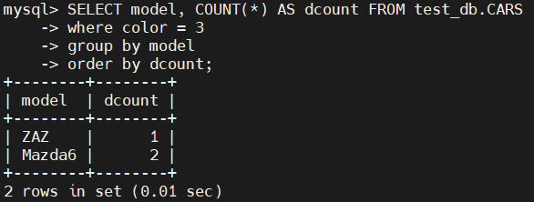

# Module 7
## Task 7.1
## Part 1
#### 1. Download MySQL server for your OS on VM. 
#### 2. Install MySQL server on VM.

```
$sudo apt install mysql-server
mysql> show databases;
```

Change the host for remote control via MySQL Workbench

```
mysql> use mysql;
mysql> select host, user from user;
mysql> update user set host='%' where user='root' and host='localhost';
```


#### 3. Select a subject area and describe the database schema, (minimum 3 tables).


#### 4. Create a database on the server through the console.
<details> 
  <summary>test_db_script.sql</summary>

```
-- MySQL Script generated by MySQL Workbench
-- Fri May  6 19:12:33 2022
-- Model: New Model    Version: 1.0
-- MySQL Workbench Forward Engineering

SET @OLD_UNIQUE_CHECKS=@@UNIQUE_CHECKS, UNIQUE_CHECKS=0;
SET @OLD_FOREIGN_KEY_CHECKS=@@FOREIGN_KEY_CHECKS, FOREIGN_KEY_CHECKS=0;
SET @OLD_SQL_MODE=@@SQL_MODE, SQL_MODE='ONLY_FULL_GROUP_BY,STRICT_TRANS_TABLES,NO_ZERO_IN_DATE,NO_ZERO_DATE,ERROR_FOR_DIVISION_BY_ZERO,NO_ENGINE_SUBSTITUTION';

-- -----------------------------------------------------
-- Schema test_db
-- -----------------------------------------------------

-- -----------------------------------------------------
-- Schema test_db
-- -----------------------------------------------------
CREATE SCHEMA IF NOT EXISTS `test_db` DEFAULT CHARACTER SET utf8mb4 ;
USE `test_db` ;

-- -----------------------------------------------------
-- Table `test_db`.`DRIVERS`
-- -----------------------------------------------------
CREATE TABLE IF NOT EXISTS `test_db`.`DRIVERS` (
  `id` INT UNSIGNED NOT NULL AUTO_INCREMENT,
  `name` VARCHAR(45) NOT NULL,
  `surname` VARCHAR(45) NOT NULL,
  `phone` VARCHAR(20) NULL,
  PRIMARY KEY (`id`),
  UNIQUE INDEX `ID_UNIQUE` (`id` ASC) VISIBLE)
ENGINE = InnoDB;


-- -----------------------------------------------------
-- Table `test_db`.`COLORS`
-- -----------------------------------------------------
CREATE TABLE IF NOT EXISTS `test_db`.`COLORS` (
  `id` INT UNSIGNED NOT NULL AUTO_INCREMENT,
  `name` VARCHAR(45) NOT NULL,
  PRIMARY KEY (`id`),
  UNIQUE INDEX `id_UNIQUE` (`id` ASC) VISIBLE)
ENGINE = InnoDB;


-- -----------------------------------------------------
-- Table `test_db`.`CARS`
-- -----------------------------------------------------
CREATE TABLE IF NOT EXISTS `test_db`.`CARS` (
  `id` INT UNSIGNED NOT NULL AUTO_INCREMENT,
  `number` VARCHAR(45) NOT NULL,
  `model` VARCHAR(45) NULL,
  `color` INT UNSIGNED NOT NULL,
  `driver` INT UNSIGNED NOT NULL,
  PRIMARY KEY (`id`),
  UNIQUE INDEX `ID_UNIQUE` (`id` ASC) VISIBLE,
  UNIQUE INDEX `number_UNIQUE` (`number` ASC) VISIBLE,
  INDEX `fk_CARS_COLORS_idx` (`color` ASC) VISIBLE,
  INDEX `fk_CARS_DRIVERS1_idx` (`driver` ASC) VISIBLE,
  CONSTRAINT `fk_CARS_COLORS`
    FOREIGN KEY (`color`)
    REFERENCES `test_db`.`COLORS` (`id`)
    ON DELETE NO ACTION
    ON UPDATE NO ACTION,
  CONSTRAINT `fk_CARS_DRIVERS`
    FOREIGN KEY (`driver`)
    REFERENCES `test_db`.`DRIVERS` (`id`)
    ON DELETE NO ACTION
    ON UPDATE NO ACTION)
ENGINE = InnoDB;


SET SQL_MODE=@OLD_SQL_MODE;
SET FOREIGN_KEY_CHECKS=@OLD_FOREIGN_KEY_CHECKS;
SET UNIQUE_CHECKS=@OLD_UNIQUE_CHECKS;

```
</details>
  
  

#### 5. Fill in tables.
```
mysql> INSERT INTO `test_db`.`COLORS`
(`name`)
VALUES
('red'), ('blue'), ('white'), ('green');
```
```
mysql> INSERT INTO `test_db`.`CARS`
(`number`,`model`,`color`,`driver`)
VALUES
('KA2897HB', 'Mazda6', 3, 2),
('BT1686BT', 'ZAZ', '2', '1');
```

#### 6. Construct and execute SELECT operator with WHERE, GROUP BY and ORDER BY.
```
mysql> SELECT model, COUNT(*) AS dcount FROM test_db.CARS
where color = 3
group by model
order by dcount;
```



#### 7. Execute other different SQL queries DDL, DML, DCL.
At these tasks, we used almost all types of commands


#### 8. Create a database of new users with different privileges. Connect to the database as a new user and verify that the privileges allow or deny certain actions.
```
mysql> create user 'oleksandr'@'%' identified by '*********';
$mysql -u oleksandr -p
```

Use root to change privileges for new users
```
$mysql -u root -p
mysql> GRANT ALL PRIVILEGES ON test_db.* TO 'oleksandr'@'%' WITH GRANT OPTION;
mysql> REVOKE INSERT ON test_db.* FROM 'oleksandr'@'%';
```


#### 9. Make a selection from the main table DB MySQL.


## Part 2
#### 10. Make backup of your database.
```
$mysqldump -u root -p test_db > backup_test_db.sql
```
#### 11. Delete the table and/or part of the data in the table.
```
mysql> drop table test_db.CARS
```
#### 12. Restore your database.
```
$mysql -u root -p test_db < backup_test_db.sql
```


#### 13. Transfer your local database to RDS AWS.


```
$mysql -u admin -p -h database-1.cdyxjennwazt.eu-central-1.rds.amazonaws.com
mysql> CREATE SCHEMA IF NOT EXISTS `test_db` DEFAULT CHARACTER SET utf8mb4 ;
mysql> exit
$mysql -u admin -p -h database-1.cdyxjennwazt.eu-central-1.rds.amazonaws.com -D test_db < backup_test_db.sql
```


#### 14. Connect to your database.
```
mysql -u admin -p -h database-1.cdyxjennwazt.eu-central-1.rds.amazonaws.com
mysql> use test_db;
mysql> show tables;
```
#### 15. Execute SELECT operator similar step 6.


#### 16. Create the dump of your database.
```
mysqldump -u admin -p -h database-1.cdyxjennwazt.eu-central-1.rds.amazonaws.com test_db > RDS_backup_test_db.sql
```

## PART 3 - MongoDB
#### 17. Create a database. Use the use command to connect to a new database (If it doesn't exist, Mongo will create it when you write to it).
```
$sudo apt install ./mongodb-mongosh_1.3.1_amd64.deb
$mongosh "mongodb+srv://cluster0.prdnt.mongodb.net/myFirstDatabase" --apiVersion 1 --username admin

mongosh> show dbs
mongosh> use test_mongo
```
#### 18. Create a collection.
```
test_mongo> db.createCollection('colors')
```


#### 19. Create some documents. Insert a couple of documents into your collection.
```
test_mongo> db.colors.insertOne({hex: "#fc0303", name: "red"});
test_mongo> db.colors.insertMany([{hex: "#00ff00", name: "green"}, {hex: "#0000ff", name: "blue"}]);
```
#### 20. Use find() to list documents out.
```
test_mongo> db.colors.find()
```

