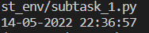
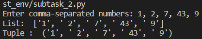
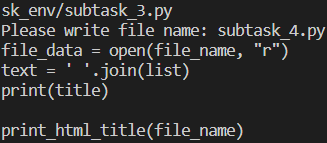
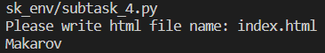
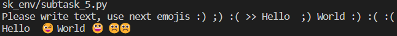
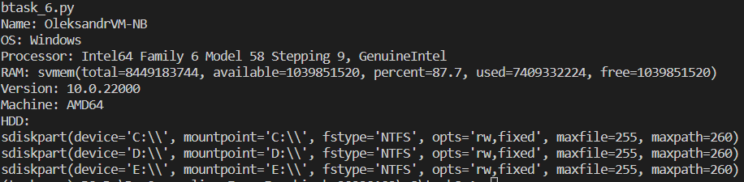

# Module 8
## Task 8.1

#### 1. Write easy program, which will display current date and time.

[subtask_1.py](/m8/task8.1/task_env/subtask_1.py)

#### 2. Write python program, which will accept comma-separated numbers, and then it  should write tuple and list of them.

[subtask_2.py](/m8/task8.1/task_env/subtask_2.py)

#### 3. Write python program, which will ask file name. File should be read, and only even lines should be shown.

[subtask_3.py](/m8/task8.1/task_env/subtask_3.py)

#### 4. Write python program, which should read html document, parse it, and show it’s title.

[subtask_4.py](/m8/task8.1/task_env/subtask_4.py)

#### 5. Write python program, which will parse user’s text, and replace some emotions with emoji’s (Look: pip install emoji)

[subtask_5.py](/m8/task8.1/task_env/subtask_5.py)

#### 6. Write program, that will show basic PC information (OS, RAM amount, HDD’s, and etc.)

[subtask_6.py](/m8/task8.1/task_env/subtask_6.py)

